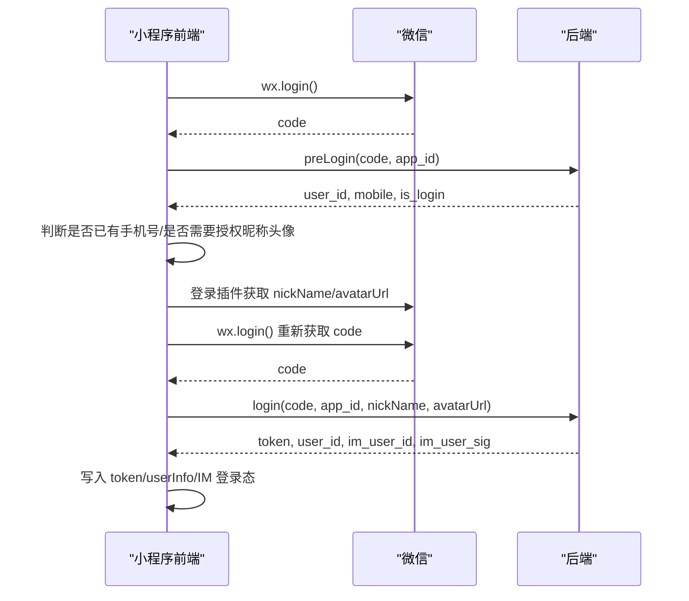
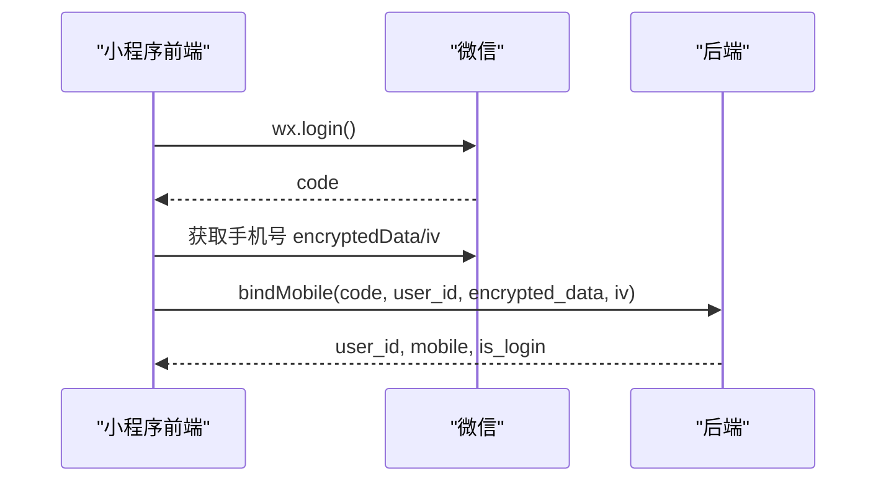

# 小程序登录接口对接文档

## 1. 基础说明

后端新增独立小程序登录接口，不复用公众号 H5 OAuth 登录。

接口基础前缀：

```text
/api/h5/miniprogram
```

小程序配置来自后端 `wechat_confs` 表，服务启动时会预热到内存。多小程序场景下，前端请求必须传 `app_id`；如果后端内存中只有一个启用小程序配置，`app_id` 可省略。

## 2. 推荐登录流程



手机号绑定流程：



## 3. 接口列表

### 3.1 登录预检

用于页面加载时检查当前微信用户是否已存在、是否已绑定手机号。

```text
POST /api/h5/miniprogram/preLogin
Content-Type: application/json
```

请求参数：

| 字段 | 类型 | 必填 | 说明 |
| --- | --- | --- | --- |
| code | string | 是 | `wx.login()` 返回的 code |
| app_id | string | 多小程序必填 | 当前小程序 AppID |
| shop_supplier_id | number | 否 | 商户/供应商 ID；私有化部署时后端会覆盖为私有化租户 |
| source | string | 否 | 来源，建议传 `wx` |
| invitation_id | string | 否 | 邀请 ID |
| referee_id | string | 否 | 推荐人 ID |

请求示例：

```json
{
  "code": "wx_login_code",
  "app_id": "wx43134e071b752953",
  "shop_supplier_id": 1,
  "source": "wx",
  "invitation_id": "",
  "referee_id": ""
}
```

成功响应：

```json
{
  "code": 0,
  "data": {
    "user_id": 123,
    "mobile": "13800138000",
    "is_login": true
  },
  "msg": "预检成功"
}
```

字段说明：

| 字段 | 类型 | 说明 |
| --- | --- | --- |
| user_id | number | C 端用户 ID，后续绑定手机号要传 |
| mobile | string | 手机号，未绑定时为空 |
| is_login | boolean | 是否已绑定手机号/可视为已完成登录资料 |

### 3.2 小程序授权登录

插件授权拿到昵称头像后调用，用于换取业务登录态和 IM 登录字段。

```text
POST /api/h5/miniprogram/login
Content-Type: application/json
```

请求参数：

| 字段 | 类型 | 必填 | 说明 |
| --- | --- | --- | --- |
| code | string | 是 | `wx.login()` 返回的 code，建议授权成功后重新获取 |
| app_id | string | 多小程序必填 | 当前小程序 AppID |
| shop_supplier_id | number | 否 | 商户/供应商 ID |
| nickName | string | 否 | 微信昵称 |
| avatarUrl | string | 否 | 微信头像 |

请求示例：

```json
{
  "code": "wx_login_code",
  "app_id": "wx43134e071b752953",
  "shop_supplier_id": 1,
  "nickName": "微信用户",
  "avatarUrl": "https://thirdwx.qlogo.cn/xxx"
}
```

成功响应：

```json
{
  "code": 0,
  "data": {
    "token": "h5_jwt_token",
    "user_id": 123,
    "im_user_id": "customer_123",
    "im_user_sig": "easemob_user_token",
    "shop_supplier_id": 1
  },
  "msg": "登录成功"
}
```

字段说明：

| 字段 | 类型 | 说明 |
| --- | --- | --- |
| token | string | 业务登录 token，后续 H5/直播接口使用 |
| user_id | number | C 端用户 ID |
| im_user_id | string | 环信 IM 用户名 |
| im_user_sig | string | 环信 IM user token；字段名兼容旧前端，不是腾讯 UserSig |
| shop_supplier_id | number | 后端实际使用的商户/供应商 ID |

登录成功后建议前端写入：

| 存储键 | 建议值 |
| --- | --- |
| token | `data.token` |
| h5_token | `data.token` |
| user_id | `data.user_id` |
| userInfo.user_id | `data.user_id` |
| userInfo.nickName | 请求时传入的 `nickName` |
| userInfo.avatarUrl | 请求时传入的 `avatarUrl` |
| globalData.is_login | `true` |
| IM 用户名 | `data.im_user_id` |
| IM token | `data.im_user_sig` |

后续需要登录的接口建议携带：

```text
Authorization: Bearer <token>
```

### 3.3 绑定手机号

继续按原生小程序逻辑绑定手机号。

```text
POST /api/h5/miniprogram/bindMobile
Content-Type: application/json
```

请求参数：

| 字段 | 类型 | 必填 | 说明 |
| --- | --- | --- | --- |
| code | string | 是 | `wx.login()` 返回的 code，绑定前重新获取 |
| app_id | string | 多小程序必填 | 当前小程序 AppID |
| user_id | number | 是 | `preLogin` 返回的用户 ID |
| encrypted_data | string | 是 | 微信手机号加密数据 |
| iv | string | 是 | 微信加密向量 |

请求示例：

```json
{
  "code": "wx_login_code",
  "app_id": "wx43134e071b752953",
  "user_id": 123,
  "encrypted_data": "encryptedData",
  "iv": "iv"
}
```

成功响应：

```json
{
  "code": 0,
  "data": {
    "user_id": 123,
    "mobile": "13800138000",
    "is_login": true
  },
  "msg": "绑定成功"
}
```

## 4. 失败处理建议

后端失败响应仍为统一结构：

```json
{
  "code": 7,
  "data": {},
  "msg": "错误原因"
}
```

前端建议：

| 场景 | 处理 |
| --- | --- |
| 未勾选协议点击登录 | 前端拦截，提示协议错误 |
| 插件取消/失败 | 提示“授权失败，请重新登录” |
| 后端缺少 token | 不跳转成功页，提示登录失败 |
| 返回“小程序配置未初始化” | 提示配置异常，联系管理员 |
| 返回“存在多个小程序配置，请传 app_id” | 检查请求是否传了当前小程序 AppID |
| IM 登录失败 | 保留业务 token，但提示直播互动初始化失败 |

## 5. 前端调用注意事项

1. `wx.login()` 的 code 一次性使用，`preLogin`、`login`、`bindMobile` 建议分别重新获取 code。
2. 多小程序环境必须传 `app_id`。
3. `im_user_sig` 是环信 user token，不是腾讯云 UserSig。
4. 登录成功后，直播间、个人中心、购物车等接口都应带业务 `token`。
5. 若 `preLogin.is_login === false`，可引导用户补手机号或继续授权昵称头像，具体按产品流程决定。
6. `shop_supplier_id` 可继续透传；私有化部署下后端会以部署租户为准。
